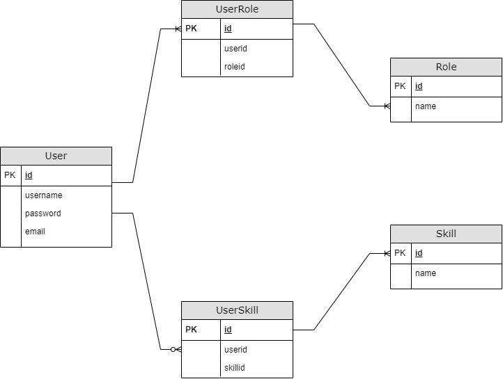

# Automation Practice App

This is an Application Programming Interface (API) where you can perform actions with users, roles this user have, skills this users might have.

## __Content__

1. [ERD Diagram](#1-erd-diagram)
1. [Swagger documentation](#2-swagger-documentation)
1. [API definitions](#3-api-definitions)

### 1. ERD Diagram

This diagram gives the idea about the entities in the project and the entities in the database (In Postgres).

### 2. Swagger documentation

You can find a swagger documentation here: [swagger-ui](https://automation-practice.herokuapp.com/swagger-ui/)
This one is not pretty accurate but gives the most important ideas about what this API can do.
You can also use in this UI the open endpoint "role-test-controller" where you can perform actions (CRUD) for role entity.

### 3. API Definitions

> This application uses authentication (Bearer token) so any action/request you want to make, need first to login. In case you don't pass a token or wrong one then you will get 401 Unauthorized status response. There is one open endpoint where you don't need token to use "__role-test-controller__". We recommend use a tool such as Postman to create the request and be able of send the Bearer token where need it. Also remember in case the system is down or have any internal issue, all endpoints might return 500 status code.

#### __Endpoints/Controllers:__

__A. Auth__

Here you can authenticate against the system and this will return a token to make the requests. Also you will be able to sign up if you want a personal account.

| Method | Endpoint | Possible return values | Description | JSON Body Example |
| ------------------ | ------------------ | ------------------ | ------------------ | ------------------ |
| POST | [/login](https://automation-practice.herokuapp.com/login) | 200 OK, 401 Unauthorized | You authenticate against the system and if the credentials are valid will give you a token with duration of one day | { &emsp;"username": "admin", &emsp;"password": "admin" } |
| POST | [/signup](https://automation-practice.herokuapp.com/signup) | 201 Created, 400 Bad Request | You can create an account in the system to login and get a token. You will be created with default role "user" | { &emsp;"username": "admin", &emsp;"password": "admin", &emsp;"email": "admin@email.com" } |

__B. Role__

| Method | Endpoint | Possible return values | Description | JSON Body Example |
| ------------------ | ------------------ | ------------------ | ------------------ | ------------------ |
| GET | [/roles](https://automation-practice.herokuapp.com/roles) | 200 OK | Get all the roles registered in the database | Empty |
| POST | [/roles](https://automation-practice.herokuapp.com/roles) | 201 Created, 400 Bad Request | Create a new role in the database system. The name should be unique | { &emsp;"name": "MyRole" } |
| GET | [/roles/{id}](https://automation-practice.herokuapp.com/roles/:id) | 200 OK, 404 Not Found | Get an specific role by it's id | Empty |
| PUT | [/roles/{id}](https://automation-practice.herokuapp.com/roles/:id) | 200 OK, 404 Not Found | Update an specific role name by it's id | { &emsp;"username": "admin", &emsp;"password": "admin" } |
| DELETE | [/roles/{id}](https://automation-practice.herokuapp.com/roles/:id) | 204 No Content, 404 Not Found | Delete from system's database a specific role | Empty |

__C. Role Test (Open API - No token needed)__

| Method | Endpoint | Possible return values | Description | JSON Body Example |
| ------------------ | ------------------ | ------------------ | ------------------ | ------------------ |
| GET | [api/test/roles](https://automation-practice.herokuapp.com/api/test/roles) | 200 OK | Get all the roles registered in the database | Empty |
| POST | [api/test/roles](https://automation-practice.herokuapp.com/api/test/roles) | 201 Created, 400 Bad Request | Create a new role in the database system. The name should be unique | { &emsp;"name": "unique name" } |
| GET | [api/test/roles/{id}](https://automation-practice.herokuapp.com/api/test/roles/:id) | 200 OK, 404 Not Found | Get an specific role by it's id | Empty |
| PUT | [api/test/roles/{id}](https://automation-practice.herokuapp.com/api/test/roles/:id) | 200 OK, 404 Not Found | Update an specific role name by it's id | { &emsp;"name": "name updated" } |
| DELETE | [api/test/roles/{id}](https://automation-practice.herokuapp.com/api/test/roles/:id) | 204 No Content, 404 Not Found | Delete from system's database a specific role | Empty |

__D. Skill__

| Method | Endpoint | Possible return values | Description | JSON Body Example |
| ------------------ | ------------------ | ------------------ | ------------------ | ------------------ |
| GET | [/skills](https://automation-practice.herokuapp.com/skills) | 200 OK | Get all the skills registered in the database. This one works with pagination so you can pass as an url parameter `page` and/or `offset` the first one if there is more than 10 elemens and the second defines how many elements will retrieve | Empty |
| POST | [/skills](https://automation-practice.herokuapp.com/skills) | 201 Created, 400 Bad Request | Create a new skill in the database system. The name should be unique | { &emsp;"name": "unique skill name" } |
| GET | [/skills/{id}](https://automation-practice.herokuapp.com/skills/:id) | 200 OK, 404 Not Found | Get an specific skill by it's id | Empty |
| GET | [/skills/mine](https://automation-practice.herokuapp.com/skills/mine) | 200 OK | Get the skills of the user who belongs the token |
| PUT | [/skills/{id}](https://automation-practice.herokuapp.com/skills/:id) | 200 OK, 404 Not Found | Update an specific skill name by it's id | { &emsp;"name": "skill name updated" } |
| DELETE | [/skills/{id}](https://automation-practice.herokuapp.com/skills/:id) | 204 No Content, 404 Not Found | Delete from system's database a specific skill | Empty |

__E. User__

| Method | Endpoint | Possible return values | Description | JSON Body Example |
| ------------------ | ------------------ | ------------------ | ------------------ | ------------------ |
| GET | [/users](https://automation-practice.herokuapp.com/users) | 200 OK | Get all the users registered in the database | Empty |
| POST | [/users](https://automation-practice.herokuapp.com/users) | 201 Created, 400 Bad Request | Create a new user in the database system. You will be created with default role "moderator" | { &emsp;"username": "username_unique", &emsp;"email": "uniqueadmin@email.com", &emsp;"password": "uniqueadmin", &emsp;"role": [ &emsp;&emsp;"admin", &emsp;&emsp;"user" &emsp;] } |
| GET | [/users/{username}](https://automation-practice.herokuapp.com/users/:username) | 200 OK, 404 Not Found | Get an specific user by it's username | Empty |
| PUT | [/users/{username}](https://automation-practice.herokuapp.com/users/:username) | 200 OK, 404 Not Found | Update an specific user name by it's username | { &emsp;"username": "username_unique", &emsp;"email": "uniqueadmin@email.com", &emsp;"roles": [ &emsp;&emsp;"admin", &emsp;&emsp;"mod" &emsp;] } |
| DELETE | [/users/{username}](https://automation-practice.herokuapp.com/users/:username) | 204 No Content, 404 Not Found | Delete from system's database a specific user | Empty |
